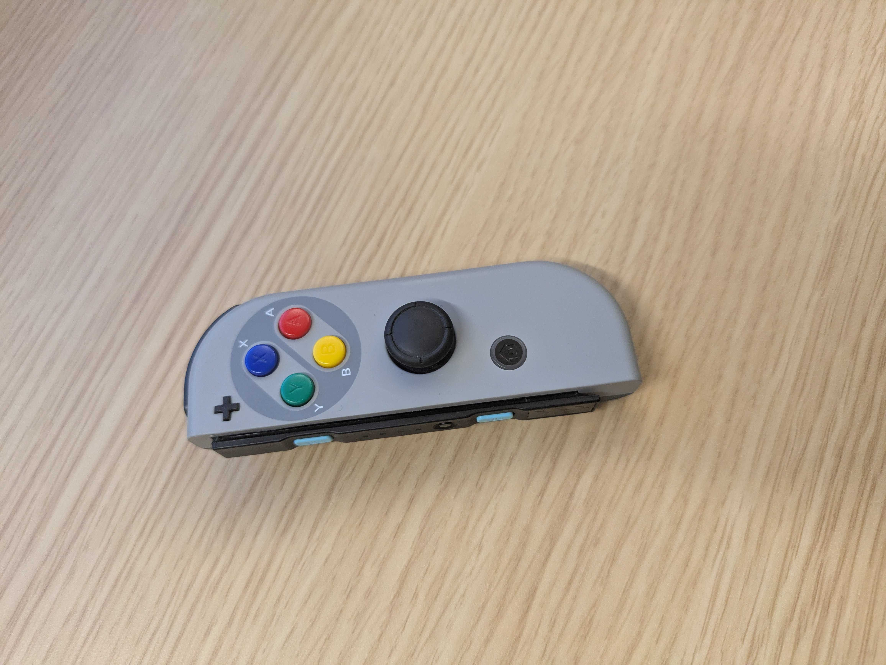
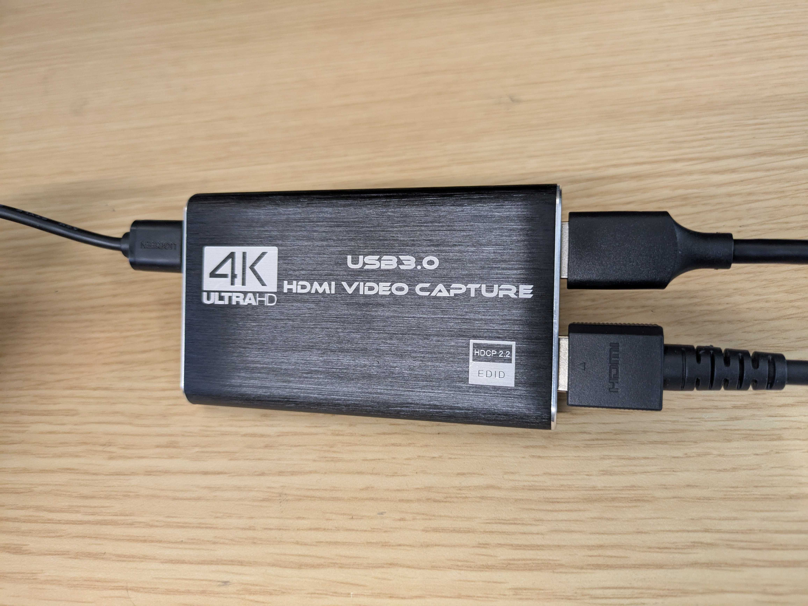

## System Requirements
This document goes through system requirements for the Switch4EAI project:

- Our setup was tested on Ubuntu 2020.4 LTS with RTX 4090 GPU.

- We use Nintendo Switch 1 with JustDance 2025 and JustDance+ for the experiment.

## Installation

1) Clone with submodules
```
git clone --recursive https://github.com/dnjsxor999/Switch4EAI_V2.git Switch4EAI
cd Switch4EAI
```

2) Create env
```
conda env create -f environment.yml
conda activate switch4eai
```

3) Install submodules in editable mode (keeps imports stable)
```
pip install -e third_party/GMR
pip install -e third_party/GVHMR
pip install -e . #our switch4eai
```

Notes:
- The env pins PyTorch 2.3.0+cu121 and Pytorch3D wheel for CUDA 12.1. Adjust if your CUDA differs.
- GMR expects body models smplx under `third_party/GMR/assets/body_models/` per its [README](https://github.com/YanjieZe/GMR/blob/master/README.md)
- GVHMR expects checkpoints (YOLO, model ckpt) under `third_party/GVHMR/inputs/checkpoints/...` per its [README](https://github.com/zju3dv/GVHMR/blob/main/docs/INSTALL.md)


## Switch Hardware Setup

| **Switch Setup (Robot)** | **Switch Setup (Online)** |
|:---:|:---:|
| [](./images/switch_controller.jpg) <br> *Attach a Nintendo Switch controller securely to the robot’s right hand. The controller is used to interact with the game in real time.* | [](./images/capture_card.jpg) <br> *Use a video capture card to stream the Nintendo Switch’s HDMI output to the Ubuntu machine for online synchronization.* |

### Switch Setup (Robot)
1) Attach a Nintendo Switch controller on the robot's right hand as shown in the below image

2) Using the Nintendo Switch controller, navigate to a desired song, press "A" button when you are ready to start the song.

### Switch Setup (Offline)
No additional setup is required. You only need to start the song and pre-recorded robot motion_file at the same time.

### Switch Setup (Online)
#### 1) Hardware Setup

Connect your hardware in the following order:
- Connect Nintendo Switch HDMI OUT → capture card HDMI IN
- Connect capture card USB to your Ubuntu machine
- Verify device appears (e.g., `/dev/video0`, `/dev/video1`)

Check permissions:
```bash
ls -l /dev/video*
# Ensure your user is in the 'video' group
groups
```

#### 2) Discover Camera Index

List available cameras:
```bash
python scripts/run_stream_to_robot.py --list-cams
# Example output: Available cameras: [1]
```

#### 3) Running the Pipeline

The pipeline requires timing information for synchronized capture:

```bash
python scripts/run_stream_to_robot.py --camera=1
```

When you run the script, you will be prompted:
```
You should Enter wait time(s) and song duration(s) for the current song:
Enter Wait Time: [enter value in seconds]
Enter Song Duration: [enter value in seconds]
Press enter again, just as you press the "a" button on the Switch Controller...
```

