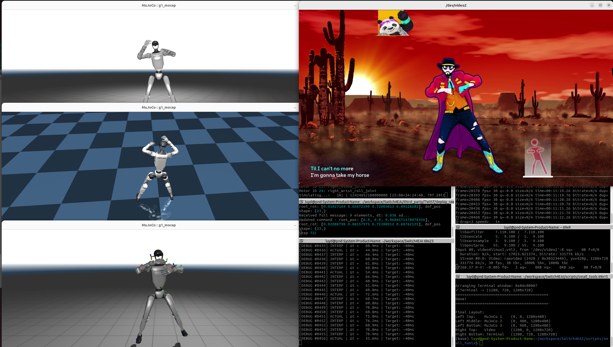

# Ubuntu Window Auto-Arrangement Script

Automatically arrange 5 windows in a custom layout on Ubuntu with a single command or keyboard shortcut.

## Layout Preview

```

┌─────────────────┬─────────────────┐
│   MuJoCo 1      │                 │
│   (Left Top)    │   Just Dance    │
├─────────────────│   /dev/video2   │
│   MuJoCo 2      │   (Right Top)   │
│   (Left Mid)    │                 │
├─────────────────┼─────────────────┤
│   MuJoCo 3      │                 │
│   (Left Bottom) │   Terminal      │
│                 │   (Right Bottom)│
└─────────────────┴─────────────────┘

```

**Screen Resolution:** 2560x1440
- Left column: 3 windows @ 1280x480 each
- Right top: 1 window @ 1280x720
- Right bottom: 1 window @ 1280x720

## Prerequisites

### System Requirements
- **OS:** Ubuntu 20.04 or later
- **Desktop Environment:** GNOME (default Ubuntu desktop)
- **Screen Resolution:** 2560x1440 (customizable)

### Dependencies

The script requires the following packages:

```bash
sudo apt update
sudo apt install -y wmctrl xdotool x11-utils libnotify-bin
```

**Package descriptions:**
- `wmctrl` - Command-line tool to interact with window manager
- `xdotool` - Command-line X11 automation tool
- `x11-utils` - X11 utilities (includes `xdpyinfo` for display info)
- `libnotify-bin` - Desktop notifications (optional, for completion notification)

### Verify Installation

```bash
# Check if wmctrl is installed
wmctrl -v

# Check if xdotool is installed
xdotool --version

# List all current windows
wmctrl -l
```

## Installation

### Step 1: Download the Script

Create the script file:

```bash
nano ~/arrange-windows.sh
```

### Step 2: Copy Script Content

Paste the following content:

```bash
#!/bin/bash
# arrange-windows.sh - Auto arrange 5 windows for 2560x1440 resolution
# Author: Your Name
# Date: 2024

# Screen resolution
SCREEN_WIDTH=2560
SCREEN_HEIGHT=1440

# Window dimensions
LEFT_WIDTH=1280
RIGHT_WIDTH=1280
LEFT_HEIGHT=480
RIGHT_TOP_HEIGHT=720
RIGHT_BOTTOM_HEIGHT=720

echo "=========================================="
echo "Starting Window Arrangement (2560x1440)"
echo "=========================================="

# Display current windows
echo "Current windows:"
wmctrl -l
echo "=========================================="

# Get MuJoCo windows (3 windows)
MUJOCO_WINS=($(wmctrl -l | grep "MuJoCo : g1_mocap" | awk '{print $1}'))

echo "Found ${#MUJOCO_WINS[@]} MuJoCo windows"

# Arrange MuJoCo windows (left column, equal size)
for i in {0..2}; do
    if [ $i -lt ${#MUJOCO_WINS[@]} ]; then
        WIN_ID=${MUJOCO_WINS[$i]}
        Y_POS=$((i * LEFT_HEIGHT))
        
        echo "Arranging MuJoCo window $((i+1)): $WIN_ID"
        
        # Remove all window states
        wmctrl -i -r $WIN_ID -b remove,maximized_vert,maximized_horz,fullscreen,hidden,shaded
        sleep 0.1
        
        # Move window
        wmctrl -i -r $WIN_ID -e 0,0,$Y_POS,$LEFT_WIDTH,$LEFT_HEIGHT
        sleep 0.1
        
        # Set again to ensure it takes effect
        wmctrl -i -r $WIN_ID -e 0,0,$Y_POS,$LEFT_WIDTH,$LEFT_HEIGHT
        
        echo "✓ MuJoCo $((i+1)) -> (0, $Y_POS, ${LEFT_WIDTH}x${LEFT_HEIGHT})"
    fi
done

# Get video window
VIDEO_WIN=$(wmctrl -l | grep "/dev/video2" | awk '{print $1}')

if [ ! -z "$VIDEO_WIN" ]; then
    echo ""
    echo "Arranging Video window: $VIDEO_WIN"
    
    # Remove all states
    wmctrl -i -r $VIDEO_WIN -b remove,maximized_vert,maximized_horz,fullscreen,hidden,shaded
    sleep 0.2
    
    # Move window (execute twice to ensure it works)
    wmctrl -i -r $VIDEO_WIN -e 0,$LEFT_WIDTH,0,$RIGHT_WIDTH,$RIGHT_TOP_HEIGHT
    sleep 0.1
    wmctrl -i -r $VIDEO_WIN -e 0,$LEFT_WIDTH,0,$RIGHT_WIDTH,$RIGHT_TOP_HEIGHT
    
    echo "✓ Video -> ($LEFT_WIDTH, 0, ${RIGHT_WIDTH}x${RIGHT_TOP_HEIGHT})"
else
    echo "✗ Video window not found"
fi

# Get Terminal window
TERM_WIN=$(wmctrl -l | grep "luyd@pnd-System-Product-Name: ~" | awk '{print $1}')

if [ ! -z "$TERM_WIN" ]; then
    echo ""
    echo "Arranging Terminal window: $TERM_WIN"
    
    wmctrl -i -r $TERM_WIN -b remove,maximized_vert,maximized_horz,fullscreen,hidden,shaded
    sleep 0.2
    
    wmctrl -i -r $TERM_WIN -e 0,$LEFT_WIDTH,$RIGHT_TOP_HEIGHT,$RIGHT_WIDTH,$RIGHT_BOTTOM_HEIGHT
    sleep 0.1
    wmctrl -i -r $TERM_WIN -e 0,$LEFT_WIDTH,$RIGHT_TOP_HEIGHT,$RIGHT_WIDTH,$RIGHT_BOTTOM_HEIGHT
    
    echo "✓ Terminal -> ($LEFT_WIDTH, $RIGHT_TOP_HEIGHT, ${RIGHT_WIDTH}x${RIGHT_BOTTOM_HEIGHT})"
fi

echo "=========================================="
echo "Done!"
echo "=========================================="

# Final layout summary
echo ""
echo "Final Layout:"
echo "Left Top:    MuJoCo 1    (0, 0, 1280x480)"
echo "Left Middle: MuJoCo 2    (0, 480, 1280x480)"  
echo "Left Bottom: MuJoCo 3    (0, 960, 1280x480)"
echo "Right Top:   Video       (1280, 0, 1280x720)"
echo "Right Bottom: Terminal   (1280, 720, 1280x720)"

# Desktop notification
command -v notify-send >/dev/null 2>&1 && \
    notify-send "Window Arrangement" "5 windows arranged successfully\nResolution: 2560x1440" -i preferences-desktop-display
```

Save and exit (`Ctrl+X`, then `Y`, then `Enter`)

### Step 3: Make Script Executable

```bash
chmod +x ~/arrange-windows.sh
```

### Step 4: Test the Script

```bash
~/arrange-windows.sh
```

## Usage

### Method 1: Run from Terminal

```bash
~/arrange-windows.sh
```

### Method 2: Add Keyboard Shortcut (Recommended)

#### GUI Method:

1. Open Settings:
   ```bash
   gnome-control-center keyboard
   ```

2. Scroll to the bottom and click **"+"** (Add Custom Shortcut)

3. Fill in the details:
   - **Name:** `Arrange Windows`
   - **Command:** `/home/YOUR_USERNAME/arrange-windows.sh`
   - **Shortcut:** Click "Set Shortcut" and press your preferred key combination
     - Recommended: `Ctrl+Alt+A` or `Super+A`

#### Command-Line Method:

```bash
# Set Super+A as the shortcut
gsettings set org.gnome.settings-daemon.plugins.media-keys custom-keybindings "['/org/gnome/settings-daemon/plugins/media-keys/custom-keybindings/custom0/']"

gsettings set org.gnome.settings-daemon.plugins.media-keys.custom-keybinding:/org/gnome/settings-daemon/plugins/media-keys/custom-keybindings/custom0/ name 'Arrange Windows'

gsettings set org.gnome.settings-daemon.plugins.media-keys.custom-keybinding:/org/gnome/settings-daemon/plugins/media-keys/custom-keybindings/custom0/ command "/home/$USER/arrange-windows.sh"

gsettings set org.gnome.settings-daemon.plugins.media-keys.custom-keybinding:/org/gnome/settings-daemon/plugins/media-keys/custom-keybindings/custom0/ binding '<Super>a'
```

### Method 3: Add to Application Launcher

Create a desktop entry:

```bash
nano ~/.local/share/applications/arrange-windows.desktop
```

Paste:

```desktop
[Desktop Entry]
Type=Application
Name=Arrange Windows
Comment=Auto-arrange 5 windows in custom layout
Exec=/home/YOUR_USERNAME/arrange-windows.sh
Icon=preferences-system-windows
Terminal=false
Categories=Utility;
```

Replace `YOUR_USERNAME` with your actual username.

## Customization

### For Different Screen Resolutions

Edit the script and modify these values:

```bash
# For 1920x1080
SCREEN_WIDTH=1920
SCREEN_HEIGHT=1080
LEFT_WIDTH=960
RIGHT_WIDTH=960
LEFT_HEIGHT=360
RIGHT_TOP_HEIGHT=540
RIGHT_BOTTOM_HEIGHT=540
```

```bash
# For 3840x2160 (4K)
SCREEN_WIDTH=3840
SCREEN_HEIGHT=2160
LEFT_WIDTH=1920
RIGHT_WIDTH=1920
LEFT_HEIGHT=720
RIGHT_TOP_HEIGHT=1080
RIGHT_BOTTOM_HEIGHT=1080
```

### For Different Window Names

If your windows have different titles, modify the grep patterns:

```bash
# Change MuJoCo window pattern
MUJOCO_WINS=($(wmctrl -l | grep "YOUR_WINDOW_NAME" | awk '{print $1}'))

# Change video window pattern
VIDEO_WIN=$(wmctrl -l | grep "YOUR_VIDEO_WINDOW" | awk '{print $1}')

# Change terminal window pattern
TERM_WIN=$(wmctrl -l | grep "YOUR_TERMINAL_NAME" | awk '{print $1}')
```

To find your window names:

```bash
wmctrl -l
```

### For Different Layouts

Modify the geometry values in the script:

```bash
# Format: wmctrl -i -r $WINDOW_ID -e 0,X,Y,WIDTH,HEIGHT
# X: horizontal position (from left)
# Y: vertical position (from top)
# WIDTH: window width
# HEIGHT: window height
```

## Troubleshooting

### Windows Not Found

**Problem:** Script reports "Window not found"

**Solution:** Check actual window names:

```bash
wmctrl -l
```

Update the grep patterns in the script to match your actual window titles.

### Windows Not Moving

**Problem:** Windows are detected but don't move

**Solutions:**

1. Check if windows are locked or pinned:
   ```bash
   # Try removing all window states
   wmctrl -i -r WINDOW_ID -b remove,maximized_vert,maximized_horz,fullscreen
   ```

2. Some applications override window manager control. Try:
   ```bash
   # Force move with xdotool
   xdotool windowmove WINDOW_ID X Y
   xdotool windowsize WINDOW_ID WIDTH HEIGHT
   ```

### Wrong Window Sizes

**Problem:** Windows are positioned correctly but sizes are wrong

**Solution:** Your window manager may be adding borders/decorations. Adjust dimensions:

```bash
# Subtract ~40 pixels for title bar and borders
LEFT_HEIGHT=440  # Instead of 480
```

### Script Doesn't Execute

**Problem:** Permission denied

**Solution:**

```bash
chmod +x ~/arrange-windows.sh
```

### Keyboard Shortcut Not Working

**Problem:** Shortcut doesn't trigger the script

**Solutions:**

1. Verify the shortcut is set:
   ```bash
   gsettings get org.gnome.settings-daemon.plugins.media-keys custom-keybindings
   ```

2. Check if the key combination conflicts with another shortcut

3. Use absolute path in shortcut command:
   ```bash
   /home/YOUR_USERNAME/arrange-windows.sh
   ```

## Advanced Usage

### Auto-arrange on Login

Add to startup applications:

```bash
gnome-session-properties
```

Or create autostart entry:

```bash
mkdir -p ~/.config/autostart
nano ~/.config/autostart/arrange-windows.desktop
```

Paste:

```desktop
[Desktop Entry]
Type=Application
Name=Auto Arrange Windows
Exec=bash -c "sleep 5 && /home/YOUR_USERNAME/arrange-windows.sh"
Hidden=false
NoDisplay=false
X-GNOME-Autostart-enabled=true
```

### Create Window Profiles

Save different layouts for different workflows:

```bash
# Create profile directory
mkdir ~/window-layouts

# Copy script for different profiles
cp ~/arrange-windows.sh ~/window-layouts/coding-layout.sh
cp ~/arrange-windows.sh ~/window-layouts/research-layout.sh

# Edit each profile with different arrangements
```

## FAQ

**Q: Does this work on Wayland?**

A: `wmctrl` has limited support on Wayland. For best results, use X11 session. You can switch at login screen.

**Q: Can I arrange more than 5 windows?**

A: Yes! Duplicate the window arrangement code blocks and adjust positions accordingly.

**Q: Will this work with floating window managers (i3, awesome)?**

A: This script is designed for stacking window managers (GNOME, KDE). For tiling WMs, use their native layout features.

**Q: Can I restore windows after arrangement?**

A: `wmctrl` doesn't save previous positions. Consider using window manager's native workspace features or create a "restore" script.

## Contributing

Feel free to modify and improve this script! Some ideas:

- [ ] Add support for different screen resolutions auto-detection
- [ ] Create GUI for easy configuration
- [ ] Save/load different layout profiles
- [ ] Support for multi-monitor setups
- [ ] Undo/restore previous layout

## License

This script is provided as-is for personal use. Feel free to modify and distribute.

## Credits

Created for Ubuntu users who need efficient multi-window workflows.

Special thanks to the developers of `wmctrl` and `xdotool`.

---

**Last Updated:** November 2024  
**Tested On:** Ubuntu 22.04 LTS, GNOME 42+
```

---

Want me to also create a shorter "Quick Start" version or add any specific sections?