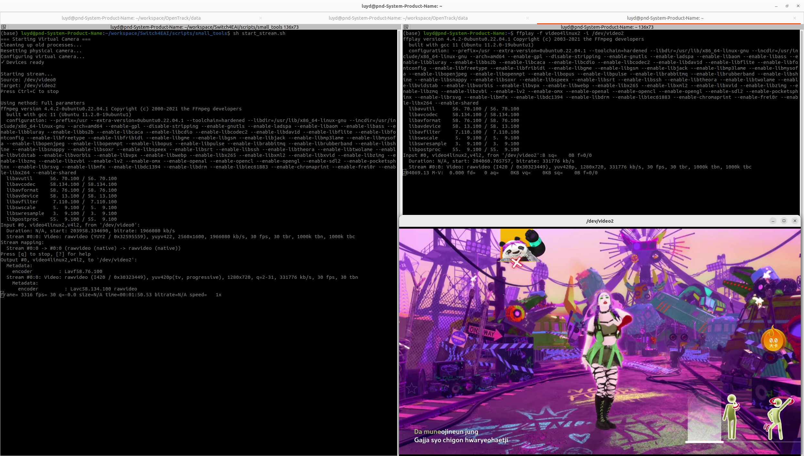

# Virtual Camera Stream Setup

This script (`start_stream.sh`) sets up a virtual camera that streams video from a physical camera device. It is useful for applications that need to access camera input through a virtual device interface.



## Overview

The script performs the following operations:
1. **Cleans up** existing processes (ffmpeg, gst-launch-1.0)
2. **Resets** the physical camera (uvcvideo module)
3. **Configures** a virtual camera using v4l2loopback
4. **Streams** video from the physical camera (`/dev/video0`) to the virtual camera (`/dev/video2`)

## Prerequisites

### Required Software
- `ffmpeg` - For video streaming and format conversion
- `ffplay` - For viewing the video stream (usually included with ffmpeg)
- `v4l2loopback` kernel module - For creating virtual video devices
- `uvcvideo` kernel module - For USB video class devices (usually built-in)

### Required Permissions
- Root/sudo access is required to:
  - Load/unload kernel modules
  - Access video devices
  - Kill processes

## Installation

### Install v4l2loopback

**Ubuntu/Debian:**
```bash
sudo apt-get update
sudo apt-get install v4l2loopback-dkms
```

**Or build from source:**
```bash
git clone https://github.com/umlaeute/v4l2loopback.git
cd v4l2loopback
make
sudo make install
```

### Install ffmpeg and ffplay

```bash
sudo apt-get install ffmpeg
```

Note: `ffplay` is typically included with the `ffmpeg` package. If not available, install it separately or build ffmpeg from source with `--enable-ffplay`.

## Usage

### Basic Usage

```bash
cd scripts/small_tools
chmod +x start_stream.sh
sudo ./start_stream.sh
```

### What the Script Does

1. **Cleanup Phase:**
   - Kills any existing ffmpeg or gst-launch processes
   - Removes old v4l2loopback modules

2. **Camera Reset:**
   - Unloads and reloads the uvcvideo module to reset the physical camera

3. **Virtual Camera Setup:**
   - Loads v4l2loopback module with:
     - Device number: 2 (`/dev/video2`)
     - Label: "Virtual Camera"
     - Exclusive capabilities enabled

4. **Streaming:**
   - Attempts multiple ffmpeg configurations:
     - **Simple conversion**: Basic YUV420P format
     - **BGR0 format**: Alternative pixel format
     - **Full parameters**: With scaling (1280x720) and specific input format

### Stopping the Stream

Press `Ctrl+C` to stop the video stream.

### Viewing the Video Stream

To verify that the virtual camera is working and view the video stream, open a new terminal and run:

```bash
ffplay -f video4linux2 -i /dev/video2
```

This will open a video player window displaying the stream from the virtual camera (`/dev/video2`).

**What you will see:**

1. **In the terminal running `start_stream.sh`:**
   - Initial setup messages (cleaning up, resetting camera, configuring virtual camera)
   - Device verification messages
   - FFmpeg version and build configuration information
   - Input stream details from `/dev/video0`:
     - Format: `rawvideo (YUY2)`, `yuyv422`
     - Resolution: `2560x1600` (or your camera's native resolution)
     - Frame rate: `30 fps`
     - Bitrate information
   - Output stream details for `/dev/video2`:
     - Format: `rawvideo`, `yuv420p`
     - Resolution: `1280x720` (scaled)
     - Frame rate: `30 fps`
   - Real-time encoding statistics:
     - Frame count (e.g., `frame= 3316`)
     - FPS (e.g., `fps= 30`)
     - Processing speed (e.g., `speed= 1x`)
     - Elapsed time (e.g., `time=00:01:50.53`)

2. **In the terminal running `ffplay`:**
   - FFplay version and build configuration
   - Input stream details from `/dev/video2`:
     - Format: `video4linux2,v4l2`
     - Video codec: `rawvideo (1420)`, `yuv420p`
     - Resolution: `1280x720`
     - Frame rate: `30 fps`
     - Bitrate: `331776 kb/s`
   - Real-time playback statistics:
     - Frame buffer information
     - Audio/video queue status

3. **In the video player window:**
   - Live video feed from the virtual camera
   - The actual content depends on what your physical camera (`/dev/video0`) is capturing
   - For example, if capturing a game screen, you'll see the game interface
   - The video will be displayed at the configured resolution (default: 1280x720)

**Controls in ffplay:**
- Press `q` or `ESC` to quit
- Press `f` to toggle fullscreen
- Press `p` or space to pause/play
- Press `s` to step to next frame
- Press `?` for help

## Device Information

- **Source Device**: `/dev/video0` (physical camera)
- **Target Device**: `/dev/video2` (virtual camera)
- **Default Resolution**: 1280x720 (when using full parameters)
- **Frame Rate**: 30 FPS

## Troubleshooting

### Error: `/dev/video0` does not exist
- Check if your camera is connected
- Verify camera is recognized: `lsusb | grep -i camera`
- Check available video devices: `ls -la /dev/video*`

### Error: `/dev/video2` does not exist
- Ensure v4l2loopback module is loaded: `lsmod | grep v4l2loopback`
- Try manually loading: `sudo modprobe v4l2loopback devices=1 video_nr=2`

### Permission Denied
- Run the script with `sudo`
- Check if your user is in the `video` group: `groups`
- Add user to video group: `sudo usermod -a -G video $USER` (requires logout/login)

### Video Quality Issues
- The script tries multiple ffmpeg configurations automatically
- You can manually edit the script to adjust:
  - Resolution (currently 1280x720)
  - Frame rate (currently 30 FPS)
  - Pixel format (yuv420p, bgr0, etc.)

### Module Loading Issues
- Check kernel compatibility: `uname -r`
- Rebuild v4l2loopback if kernel was updated
- Check dmesg for errors: `dmesg | tail -20`

## Advanced Configuration

### Custom Resolution

Edit line 55-58 in the script to change resolution:
```bash
ffmpeg -f v4l2 -input_format yuyv422 -video_size 2560x1600 -framerate 30 -i /dev/video0 \
  -vf "scale=1920:1080,format=yuv420p" \  # Change scale here
  -pix_fmt yuv420p \
  -f v4l2 /dev/video2
```

### Different Virtual Device Number

Change `video_nr=2` on line 22 to use a different device number:
```bash
sudo modprobe v4l2loopback devices=1 video_nr=3 card_label="Virtual Camera" exclusive_caps=1
```

## Use Cases

- **OBS Studio**: Use virtual camera as a source
- **Video Conferencing**: Route camera through virtual device
- **Screen Recording**: Combine with screen capture tools
- **Testing**: Test applications that require specific video device paths

## Notes

- The script uses `set -e` to exit on any error
- All operations require root privileges
- The virtual camera persists until the system reboots or module is unloaded
- Multiple virtual cameras can be created by running the script multiple times with different `video_nr` values

## Related Files

- `arrange-windows.sh` - Window management script
- `arrange-windows.md` - Window arrangement documentation

## References

- [v4l2loopback GitHub](https://github.com/umlaeute/v4l2loopback)
- [FFmpeg Documentation](https://ffmpeg.org/documentation.html)
- [V4L2 Documentation](https://www.kernel.org/doc/html/latest/userspace-api/media/v4l/v4l2.html)

